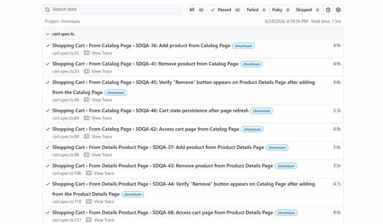

# :gear: SauceDemo Playwright Automation

## Overview

This repository contains an automated test suite for the SauceDemo e-commerce application using **Playwright** and **TypeScript**.

This project complements the **[SauceDemo Manual Testing](https://github.com/cirsvi/saucedemo-manual-qa)** repository (for more details, see **[Manual Testing](#manual-testing)**). Every automated test is mapped to a manual test case ID to preserve traceability across both projects. The project follows **Page Object Model (POM)** design pattern and uses custom fixtures and utilities to keep tests maintainable and readable.

<p align="center">
  <br>
  <em>Playwright HTML report after a full test run (all tests executed as expected)</em>
</p>

## Test Coverage

The automated suite covers **62 test cases** across the main features of the application. The table below shows the distribution by feature (numbers correspond to the test cases).

| Feature         | Number of Tests |
|-----------------|------------|
| Login           | 11         |
| Logout          | 2          |
| Product Catalog | 7          |
| Shopping Cart   | 13         |
| Checkout        | 29         |

For the detailed list of test cases, see the **[Manual Test Case Overview](https://github.com/cirsvi/saucedemo-manual-qa/blob/main/test-cases/tests-overview.md)**.

## Known Defects & Expected Failures

The SauceDemo application contains several known defects that have been documented in the manual testing repository. Tests that reproduce defects are wrapped with `test.fail()` so they are reported as **expected failures** rather than breaking the CI pipeline. Each such test includes a **bug annotation** (type: 'bug') linking it to the corresponding issue ID.

Example:
```typescript
test.fail('SDQA-16: Tab navigation', async ({ page }) => {
    test.info().annotations.push({
        type: 'bug',
        description: 'SDQA-118',
    });
    // test body ...
});
```

> As mentioned in [Overview](#overview), all automated test cases contain the manual test case ID in their title (e.g., `SDQA-3`).

For the complete list of documented bugs, see the **[Manual Bug Report Overview](https://github.com/cirsvi/saucedemo-manual-qa/blob/main/bugs/bugs-overview.md)**.

## Tech Stack 
- **Playwright** with **TypeScript**
- **Page Object Model (POM)**: page classes under `/pages`
- **Custom fixtures**: reusable setup under `/fixtures`
- **Utility helpers**:  reusable utilities under `utils`
- **Test data**: centralized data under `/test-data`
- **Prettier**: code formatting (configuration in `.prettierrc`)
- **GitHub Actions**: CI pipeline (workflow under `.github/workflows`)

## Configuration
The Playwright configuration is defined in `playwright.config.ts`. Key settings include:
- **Base URL:** `https://www.saucedemo.com/`
- **Browsers:** Chromium, Firefox, WebKit
- **Timeout:** default (30 seconds per test)
- **Retries:** 0 on local, 2 on CI
- **Trace:** enabled on first retry
- **Test ID attribute:** `data-test`
- **Reporter:** HTML report

## Getting Started

### Prerequisites
- Node.js (version 18 or later)
- npm

### Installation
1. Clone the repository:
   ```bash
   git clone https://github.com/cirsvi/saucedemo-playwright.git
   cd saucedemo-playwright
   ```
2. Install dependencies:
    ```bash
    npm install
    ```
3. Install Playwright browsers:
    ```bash
    npx playwright install
    ```

### Test Execution
Run the full suite headlessly:
```bash
npx playwright test
```
Or run with the Playwright UI mode:
```bash
npx playwright test --ui
```


## Continuous Integration (CI)
This project uses **GitHub Actions** for CI. The workflow (`.github/workflows/playwright.yml`, named **"SauceDemo E2E Tests"**) triggers on every `push` and `pull` request to the `main` branch.

The CI pipeline installs dependencies and browsers, runs the full Playwright suite, and uploads generated HTML report as an artifact.

## Project Structure
- `.github/workflows/`: GitHub Actions CI pipeline definitions.
- `components/`: Reusable UI fragments (if any).
- `fixtures/`: Playwright custom fixtures for common test setup.
- `pages/`: Page Object Model classes representing application pages.
- `test-data/`: Static test data (customers, error messages, products).
- `tests/`: Test spec files grouped by feature.
    - `login.spec.ts`
    - `logout.spec.ts`
    - `productCatalog.spec.ts`
    - `cart.spec.ts`
    - `checkout/` – Checkout tests split by sub‑feature:
        - `cart-checkout.spec.ts`
        - `checkout-access.spec.ts`
        - `information-checkout.spec.ts`
        - `overview-checkout.spec.ts`
        - `complete-checkout.spec.ts`
- `utils/`: Helper functions for background color retrieval, price sum calculation, sorting verification, etc.
- `.prettierrc`: Prettier configuration file.
- `playwright.config.ts`: Playwright configuration.
- `package.json` / `package-lock.json`: Project dependencies and scripts.

## Manual Testing

This automation project is built on top of the manual test suite documented in **[SauceDemo Manual Testing](https://github.com/cirsvi/saucedemo-manual-qa)**. The manual repository contains user stories, test cases, execution reports, and bug reports. The automation covers all 62 manual test cases and follows the same feature grouping for consistency.